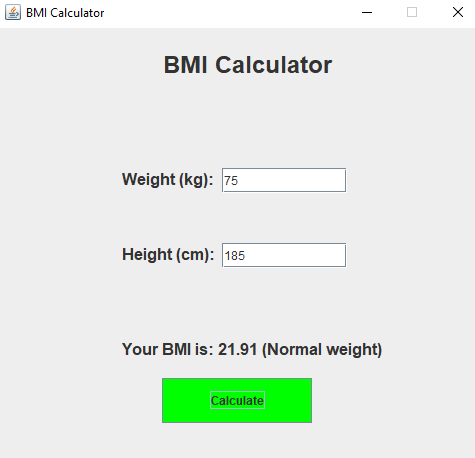

# BMI Calculator (Java)

A simple BMI (Body Mass Index) calculator made using Java and Swing. It allows users to input their weight and height to calculate BMI.

## Features
- Simple GUI interface
- BMI formula calculation: weight (kg) / (height (m))²
- Result display with health category (Optional: Underweight, Normal, Overweight, etc.)

## How to Run
1. Clone this repo
2. Compile: `javac Calculator.java`
3. Run: `java Calculator`

## Screenshot

## Note
This was a beginner project for learning Java GUI with Swing.
